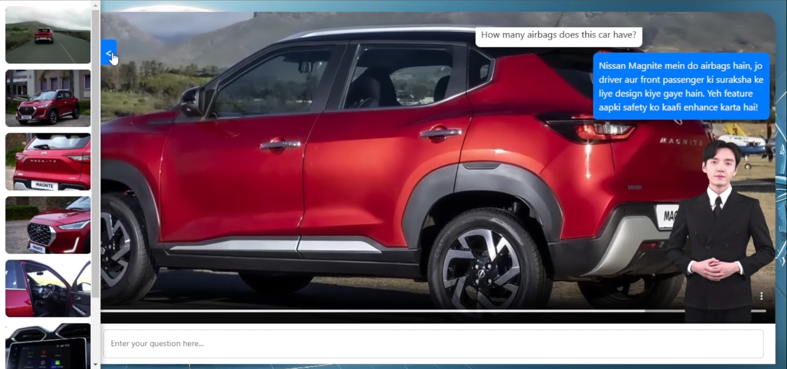

# TTS AVATAR

Welcome to the **TTS Avatar**! This project showcases the integration of Azure AI's Text-to-Speech Avatar feature into a ReactJS application. With this application, you can bring lifelike synthetic talking avatars to your projects effortlessly.

---

## 🌟 **Demo**

[🎥 Watch the Demo Video](https://drive.google.com/file/d/13liFTedLCbXuRmWskauEBDct70rtL4PL/view?usp=sharing)

Explore the Azure Avatar in action through our demo video! Witness how synthetic avatars come alive and communicate seamlessly.

---

## 🖼️ **Home Screen**



> _*Add a screenshot of your application here to give users a visual overview of what to expect.*_

---

## ⚠️ **Notice**

Microsoft is retiring Azure TURN services, which are used by the Azure TTS Avatar for communication. To ensure continuity, this project includes a script to set up your own TURN server:

- Execute the `installCoturn.sh` script on an Ubuntu instance to configure your TURN server.
- For detailed guidance, refer to this article: [Azure Avatar TTS Update](https://raokarthik83.medium.com/azure-avatar-tts-update-migrating-from-azure-turn-to-coturn-14b6ac86d60c).

---

## 🚀 **Getting Started**

Follow these steps to set up and run the application locally:

### 📋 **Prerequisites**

- Install **Node.js** and **npm** on your machine.
- An Azure account with access to the necessary services.

### 🛠️ **Installation**

1. **Clone the Repository:**

   ```bash
   git clone https://github.com/dushyant60/Video_Avatar/tree/main
   cd Frontend
   ```

2. **Install Dependencies:**

   ```bash
   npm install
   ```

3. **Configure Environment Variables:**

   Create a `.env` file in the root directory and add the following:

   ```plaintext
   REACT_APP_COG_SVC_REGION=your-region
   REACT_APP_COG_SVC_SUB_KEY=your-subscription-key
   REACT_APP_VOICE_NAME=your-voice-name
   REACT_APP_AVATAR_CHARACTER=your-avatar-character
   REACT_APP_AVATAR_STYLE=your-avatar-style
   REACT_APP_AVATAR_BACKGROUND_COLOR=your-avatar-background-color
   REACT_APP_AZURE_OPENAI_ENDPOINT=your-openai-endpoint
   REACT_APP_AZURE_OPENAI_KEY=your-openai-key
   ```

4. **Start the Application:**

   ```bash
   npm start
   ```

   Access the application at [http://localhost:3000](http://localhost:3000).

---

## 🛡️ **Tech Stack**

- **ReactJS**: A powerful library for building interactive UIs.
- **Azure Cognitive Services**: Enables text-to-speech and other AI-driven functionalities.
- **Styled-components**: Provides seamless styling for components.
- **WebRTC**: Facilitates real-time communication capabilities.

---

## 🔧 **Configuration**

Ensure that the necessary API keys and environment settings are properly configured in the `.env` file before running the application.

---

## 💬 **Feedback and Issues**

We’d love to hear from you! If you encounter any issues or have suggestions, please open an issue in the repository. Your contributions and feedback help us improve!

---

## 🎉 **Happy Coding!**

Unleash the power of AI with Azure Avatar and create engaging, interactive experiences like never before. Let’s build something amazing together!

